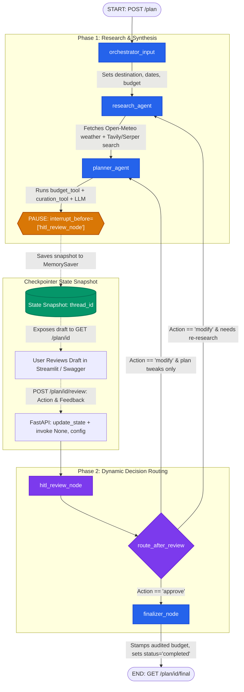

# 🧠 Complete System Mind Map: Stateful AI Travel Planner

This document provides an exhaustive, in-depth architectural and code-level mind map of the entire application. It covers every single file, function name, class, schema, tool, LangGraph term, and API endpoint.

---

## 1. Visual Master Mind Map (Mermaid)

```mermaid
mindmap
  root((Stateful AI Travel Planner))
    FastAPI REST API Layer [travel_planner/app/main.py]
      Endpoints
        POST /plan :: Starts workflow up to breakpoint
        GET /plan/{id} :: Inspects state snapshot & research
        POST /plan/{id}/review :: Submits HITL review & resumes graph
        GET /plan/{id}/final :: Retrieves finalized trip package
        GET / :: Redirects to /docs
      Core Concepts
        UUID plan_id -> LangGraph thread_id
        StateSnapshot values & next
        HTTP Status Codes: 201, 200, 400, 404, 422, 500
        invoke(initial_state, config)
        update_state(config, feedback)
        invoke(None, config) -> Resumes from paused state
    Pydantic Schemas [travel_planner/app/models/schemas.py]
      PlanRequest :: destination, travel_dates, budget_range, travelers_count, interests
      PlanResponse :: plan_id, status
      ReviewRequest :: action (approve|reject|modify), feedback
      PlanStatusResponse :: Complete state snapshot projection
      FinalPlanResponse :: plan_id, final_itinerary
    LangGraph Workflow Engine [travel_planner/app/graph/workflow.py]
      StateGraph(TravelPlanState)
      Registration of 5 Nodes
      Deterministic Edges
        START -> orchestrator_input
        orchestrator_input -> research_agent
        research_agent -> planner_agent
        planner_agent -> hitl_review_node
        finalizer_node -> END
      Conditional Edges
        hitl_review_node -> route_after_review
          -> research_agent (if feedback triggers weather/dates)
          -> planner_agent (if feedback is plan tweaks)
          -> finalizer_node (if approved)
      Compilation & Persistence
        MemorySaver() checkpointer
        interrupt_before=['hitl_review_node']
        Singleton: travel_planner_workflow
    State Channels [travel_planner/app/graph/state.py]
      TravelPlanState TypedDict
        Input Channels: destination, travel_dates, budget_range, travelers_count, interests
        Research Channel: research_data (weather, search_brief)
        Drafting Channel: draft_itinerary
        HITL Channels: user_feedback, feedback_status, status
        Routing Channel: next_route
    Agent Nodes & Logic [travel_planner/app/graph/agents.py]
      LLM Client Factory: get_llm()
        ChatOpenAI (gpt-4o-mini, temp=0.2)
        ChatGroq (openai/gpt-oss-20b, temp=0.2)
      Token Optimization
        extract_itinerary_skeleton() -> Cuts 80%+ tokens in revision loops
      Node 1: orchestrator_input()
        Validates mandatory inputs & initializes state channels
      Node 2: research_agent()
        Queries weather_tool & search_tool -> research_data
      Date Helper: calculate_calendar_days()
        Regex extracts YYYY-MM-DD -> inclusive duration
      Node 3: planner_agent()
        Runs allocate_budget & curate_recommendations
        Builds grounded day-by-day prompt
        Cleans reasoning tokens (<think> tags)
        Validates Day 1..N coverage
        Fallback to generate_template_itinerary()
      Node 4: hitl_review_node()
        Keyword classifier: triggers -> research_agent vs planner_agent vs finalizer
      Node 5: finalizer_node()
        Calculates audited budget table with 10% contingency
        Strips LLM hallucinations, wraps headers/footers, sets status='completed'
      Fallback Engine: generate_template_itinerary()
        Deterministic procedural generation for 100% uptime
    Modular Tool Suite [travel_planner/app/tools/]
      budget_tool.py
        allocate_budget() :: Itemized cost model for Economy, Moderate, Luxury
        parse_duration_days() :: Inclusive calendar day calculator
        Room Allocation Math: (travelers_count + 1) // 2
        Emergency Buffer: 10% contingency calculation
      curation_tool.py
        curate_recommendations() :: Interest and budget scoring
        RECOMMENDATIONS DB: Paris & Tokyo curated spots
        Scoring Formula: +1 per matching interest tag, +2 for budget tier
        Dynamic Fallback Generator for unlisted destinations
      weather_tool.py
        get_destination_weather() :: 2-step Open-Meteo REST API
        Step 1: Geocoding API -> city name to latitude/longitude
        Step 2: Forecast API -> 7-day max/min temps & rain probability
        Rule-Based Clothing Heuristics: Layered, warm jackets, umbrella
        get_mock_weather_data() :: Offline fallback with 5.0s timeout
      search_tool.py
        perform_web_search() :: Multi-tier fallback cascade
          Tier 1: Tavily AI Search
          Tier 2: Serper Google Search
          Tier 3: Local Curated Mock DB
        clean_snippet() :: Regex strips HTML tags, URLs & truncates to 120 chars
    Frontend & Verification
      Streamlit Dashboard [app_ui.py]
        Session State Management
        Tab 1: Planner Workspace (Inputs & HITL Console)
        Tab 2: Internal State Inspector (Raw JSON State)
        Tab 3: External Research Insights (Weather & Search)
        Tab 4: Budget Calculations (Itemized breakdown)
      E2E Integration Suite [test_flow.py]
        FastAPI TestClient simulation
        6-step invariant assertion test suite
```

---

## 2. End-to-End Workflow & State Transition Flowchart



---

## 3. Deep-Dive Code Breakdown by File

### 📁 `travel_planner/app/graph/state.py` (The State Blackboard)
- **Class:** `TravelPlanState(TypedDict)`
  - **Why TypedDict?** Static type hinting without runtime Pydantic re-parsing overhead on every node transition.
- **Channels (Keys):**
  1. `destination: str` — Destination city/region.
  2. `travel_dates: str` — Travel window (e.g. `2026-09-10 to 2026-09-14`).
  3. `budget_range: str` — `Economy`, `Moderate`, or `Luxury`.
  4. `travelers_count: int` — Group size for room and per-person cost calculations.
  5. `interests: List[str]` — User passions (e.g. `["museums", "street food"]`).
  6. `research_data: Dict[str, Any]` — Holds `weather` metrics and `search_brief`.
  7. `draft_itinerary: str` — Markdown itinerary text.
  8. `user_feedback: str` — Comments injected during review.
  9. `feedback_status: Literal["approve", "reject", "modify", ""]` — HITL action.
  10. `status: str` — State lifecycle (`started` $\to$ `research_completed` $\to$ `pending_review` $\to$ `revised` $\to$ `approved` $\to$ `completed`).
  11. `next_route: Optional[str]` — Dynamic routing pointer evaluated by conditional edges.

---

### 📁 `travel_planner/app/graph/workflow.py` (Graph Orchestration)
- **Functions:**
  - `route_after_review(state: TravelPlanState) -> str`:
    - Reads `state["next_route"]`.
    - Returns `"research_agent"`, `"planner_agent"`, or `"finalizer_node"`.
  - `build_workflow() -> CompiledGraph`:
    - `StateGraph(TravelPlanState)`: Instantiates builder.
    - `add_node(...)`: Registers all 5 node functions.
    - `add_edge(...)`: Configures static paths.
    - `add_conditional_edges("hitl_review_node", route_after_review, mapping)`: Configures dynamic branching.
    - `builder.compile(checkpointer=MemorySaver(), interrupt_before=["hitl_review_node"])`: Attaches checkpointer and pauses execution right before Node 4.
- **Singleton Export:** `travel_planner_workflow = build_workflow()`.

---

### 📁 `travel_planner/app/graph/agents.py` (Node Logic & Reasoning)
- **Functions & Roles:**
  - `get_llm()`: Dynamically loads `ChatGroq` or `ChatOpenAI` at `temperature=0.2`.
  - `extract_itinerary_skeleton(itinerary: str) -> str`:
    - **Token Optimization:** Uses regex to extract only `### Day X` headers and high-level bullet points. Strips 80%+ of tokens to prevent context explosion and HTTP 413 payload errors during revisions.
  - `orchestrator_input(state)`: Validates mandatory input fields and initializes state.
  - `research_agent(state)`: Calls `get_destination_weather()` and `perform_web_search()`.
  - `calculate_calendar_days(travel_dates: str) -> int`: Extracts ISO dates with regex and computes inclusive calendar duration `(d2 - d1).days + 1`.
  - `planner_agent(state)`:
    - Runs `allocate_budget()` and `curate_recommendations()`.
    - Injects skeleton of previous draft if `user_feedback` is present.
    - Enforces Day 1 to Day N constraints in system and user prompts.
    - Cleans reasoning tags (`<think>...</think>`).
    - Validates post-generation day coverage.
    - Falls back to `generate_template_itinerary()` if LLM fails.
  - `hitl_review_node(state)`:
    - If action is `approve` $\to$ sets `next_route = "finalizer"`.
    - If action is `modify` $\to$ checks feedback for keywords (`weather`, `date`, `days`, `rain`, etc.). If found, routes to `research_agent`; otherwise routes directly to `planner_agent`.
  - `finalizer_node(state)`: Computes final audited budget summary with 10% emergency buffer, strips hallucinated budget blocks, appends header/footer, and sets `status = "completed"`.
  - `generate_template_itinerary(...)`: Procedural fallback generator guaranteeing 100% system availability.

---

### 📁 `travel_planner/app/main.py` (FastAPI REST API Layer)
- **Endpoints:**
  1. `GET /` $\to$ Redirects to interactive OpenAPI docs at `/docs`.
  2. `POST /plan` (`response_model=PlanResponse`, status `201 Created`):
     - Generates UUID `plan_id`.
     - Creates `config = {"configurable": {"thread_id": plan_id}}`.
     - Calls `workflow.invoke(initial_state, config)`.
     - Reads `get_state(config)` to verify pause at `hitl_review_node`.
     - Returns `{"plan_id": ..., "status": "pending_review"}`.
  3. `GET /plan/{id}` (`response_model=PlanStatusResponse`):
     - Queries checkpointer via `workflow.get_state(config)`.
     - Returns 404 if not found; otherwise exposes full state snapshot.
  4. `POST /plan/{id}/review` (`response_model=PlanResponse`):
     - Validates that thread is paused at `hitl_review_node` (HTTP 400 if not).
     - Calls `workflow.update_state(config, {"user_feedback": ..., "feedback_status": ...})`.
     - Calls `workflow.invoke(None, config)` to resume execution from breakpoint.
  5. `GET /plan/{id}/final` (`response_model=FinalPlanResponse`):
     - Verifies `status == 'completed'` (HTTP 400 if accessed prematurely).
     - Returns finalized itinerary markdown.

---

### 📁 `travel_planner/app/models/schemas.py` (Pydantic Data Contracts)
- **Schemas:**
  - `PlanRequest`: Input DTO with field validations (`destination`, `travel_dates`, `budget_range`, `travelers_count >= 1`, `interests`).
  - `PlanResponse`: Lightweight acknowledgment DTO (`plan_id`, `status`).
  - `ReviewRequest`: HITL review DTO (`action: Literal["approve", "reject", "modify"]`, `feedback: str`).
  - `PlanStatusResponse`: Complete projection DTO for inspecting state snapshots in UI.
  - `FinalPlanResponse`: Final artifact DTO (`plan_id`, `final_itinerary`).

---

### 📁 `travel_planner/app/tools/` (Modular Deterministic & API Tools)

#### 1. `budget_tool.py`
- `parse_duration_days(travel_dates)`: Date arithmetic helper.
- `allocate_budget(budget_range, travelers_count, travel_dates)`:
  - **Spending Tiers:** Economy ($60 room, $30 food, $15 transit, $20 activities), Luxury ($450 room, $220 food, $120 transit, $150 activities), Moderate ($160 room, $85 food, $45 transit, $60 activities).
  - **Room Allocation:** `(travelers_count + 1) // 2` (pairs sharing rooms).
  - **Contingency Reserve:** Calculates mandatory 10% emergency buffer.

#### 2. `curation_tool.py`
- `RECOMMENDATIONS`: Pre-verified database of dining and attractions for Paris and Tokyo.
- `curate_recommendations(destination, interests, budget_range)`:
  - Heuristic scoring: `+1` per matching interest tag, `+2` for matching budget tier.
  - Sorts descending by match score.
  - Universal dynamic generator fallback for cities outside the static DB.

#### 3. `weather_tool.py`
- `get_destination_weather(destination)`:
  - Step 1: Open-Meteo Geocoding API (`https://geocoding-api.open-meteo.com/v1/search?name=...`).
  - Step 2: Open-Meteo Forecast API (`https://api.open-meteo.com/v1/forecast?latitude=...&daily=...`).
  - Rule-based clothing tips based on temperature thresholds (<10°C, >30°C) and rain chance (>40%).
- `get_mock_weather_data(destination)`: Offline fallback with 5.0-second timeout guard.

#### 4. `search_tool.py`
- `clean_snippet(text)`: Regex sanitizer stripping HTML tags `<[^>]+>` and URLs `https?://\S+`, truncating to 120 chars.
- `perform_web_search(destination, query_type)`:
  - **Cascading Fallback:** Tavily API $\to$ Serper Google Search API $\to$ Mock Local Knowledge Base.

---

### 📁 Frontend & Testing
- **`app_ui.py` (Streamlit Dashboard):**
  - Session state persistence for `plan_id`, `graph_values`, and `execution_logs`.
  - 4 interactive tabs:
    - Tab 1: **Planner Workspace** (Inputs form, status badge, draft viewer, HITL review actions).
    - Tab 2: **Internal State Inspector** (Raw JSON dump of LangGraph state channels).
    - Tab 3: **External Research Insights** (Open-Meteo weather cards & web search snippets).
    - Tab 4: **Budget Calculations** (Itemized cost metrics & contingency charts).
- **`test_flow.py` (E2E Integration Test Suite):**
  - Uses FastAPI `TestClient(app)`.
  - Simulates the full 6-step lifecycle:
    1. `POST /plan` $\to$ asserts 201 Created & status `pending_review`.
    2. `GET /plan/{id}` $\to$ asserts draft exists.
    3. `GET /plan/{id}/final` before review $\to$ asserts 400 Bad Request.
    4. `POST /plan/{id}/review` (action `modify`) $\to$ asserts status `pending_review`.
    5. `POST /plan/{id}/review` (action `approve`) $\to$ asserts status `completed`.
    6. `GET /plan/{id}/final` $\to$ asserts 200 OK & finalized travel plan returned.

---

## 4. Key LangGraph Terms Quick Reference Table

| Term | Role in Project | Location |
|---|---|---|
| **`StateGraph`** | Graph class constructing the state machine | `workflow.py` |
| **`TravelPlanState`** | TypedDict defining the state blackboard channels | `state.py` |
| **`Nodes`** | The 5 agent processing units | `agents.py` |
| **`Edges`** | Static directed transitions | `workflow.py` |
| **`Conditional Edges`** | Dynamic routing branches via `route_after_review` | `workflow.py` |
| **`START` / `END`** | Built-in entry and exit virtual nodes | `workflow.py` |
| **`MemorySaver`** | In-memory thread checkpointer | `workflow.py` |
| **`thread_id`** | Partitioning UUID key for user sessions | `main.py` |
| **`interrupt_before`** | Pauses graph right before `hitl_review_node` | `workflow.py` |
| **`HITL`** | Human-in-the-Loop approval architecture | `main.py` & `workflow.py` |
| **`invoke(None, config)`** | Resumes paused graph from current checkpoint | `main.py` |
| **`get_state()`** | Reads latest `StateSnapshot` (`values`, `next`) | `main.py` |
| **`update_state()`** | Mutates state with user feedback before resuming | `main.py` |
| **`Skeleton Extractor`** | Strips 80%+ tokens to prevent context explosion | `agents.py` |
