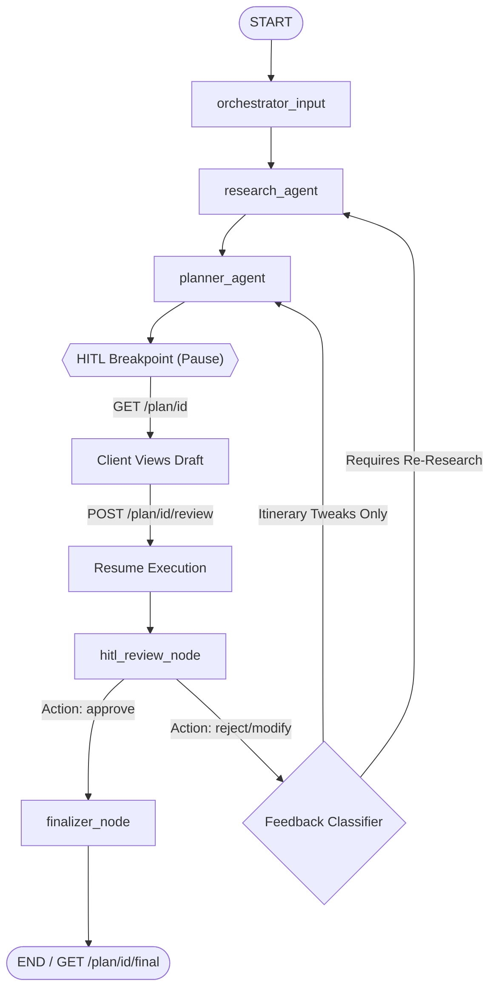

# Stateful AI Travel Planner Backend

This is a production-ready, stateful AI Travel Planner backend built using **FastAPI** and **LangGraph**. It implements a stateful multi-agent workflow featuring Human-in-the-Loop (HITL) approval, allowing users to inspect, reject, modify, or approve travel plans.

## System Architecture

The workflow is orchestrated using LangGraph's state graph. It consists of specialized nodes that pass state values and save snapshot checkpointers at checkpoints.



### Components

1. **Orchestrator (`orchestrator_input`)**: Validates initial user inputs (dates, destination, interests, travelers) and initializes state parameters.
2. **Research Agent (`research_agent`)**: Gathers real-time intelligence for the destination. It calls search engines (Tavily/Serper/Exa) and queries coordinates and weekly forecasts via the free **Open-Meteo REST API**.
3. **Planner Agent (`planner_agent`)**: Takes destination insights and computes a day-by-day itinerary. It relies on a deterministic **Budget Allocator Tool** to calculate cost splits (lodging, transit, meals, activities) and a **Local Curation Tool** to rank dining spots and attractions matching visitor interests.
4. **HITL Review Node (`hitl_review_node`)**: Activated when execution resumes from the breakpoint. It consumes feedback actions (`approve`, `reject`, `modify`). If revised, it classifies feedback to determine if new weather or search inquiries are required (re-routing to `research_agent`) or if it only requires plan adjustments (re-routing to `planner_agent`).
5. **Finalizer (`finalizer_node`)**: Formats the final approved trip plan, appends the budget breakdown summary, and labels the status as `completed`.

---

## Setup & Run Instructions

### Prerequisites
- Python 3.12+ (Python 3.12.10 is installed on this host)
- An internet connection (for Open-Meteo REST API)

### 1. Configure Environment Variables
Copy `.env.example` to `.env`:
```bash
cp .env.example .env
```
Fill in the API keys in `.env` if you want to use live LLMs and search engines (the system automatically falls back to deterministic mock structures and template generators if keys are missing):
```env
OPENAI_API_KEY=sk-...
TAVILY_API_KEY=tvly-...
```

### 2. Install Dependencies
Install dependencies globally or inside your virtual environment:
```bash
pip install -r requirements.txt
```

### 3. Run the Server
Launch the FastAPI development server using Uvicorn:
```bash
uvicorn travel_planner.app.main:app --reload
```
The server will run on `http://127.0.0.1:8000`. You can access interactive Swagger docs at `http://127.0.0.1:8000/docs` (with a root redirect mapping `http://127.0.0.1:8000` to `/docs` automatically).

### 4. Run the Streamlit Dashboard (Optional)
To run the interactive UI dashboard locally:
```bash
streamlit run app_ui.py
```
A live version of the Streamlit dashboard is also hosted and accessible at:
👉 **[travelplanner420.streamlit.app](https://travelplanner420.streamlit.app)**

---

## Verification & Testing

A verification script is included to simulate end-to-end user actions, including:
1. Creating a plan request (checking that it pauses at the interrupt).
2. Requesting modifications (routing back to research).
3. Approving the updated plan (routing to finalizer).
4. Extracting the completed itinerary.

To run the verification test:
```bash
python test_flow.py
```

---

## API Documentation & Example Curl Commands

### 1. Create a Travel Plan (`POST /plan`)
Initiates the state graph and runs up to the review interrupt.

**Request:**
```bash
curl -X POST "http://127.0.0.1:8000/plan" \
     -H "Content-Type: application/json" \
     -d '{
       "destination": "Paris",
       "travel_dates": "2026-09-10 to 2026-09-15",
       "budget_range": "Moderate",
       "travelers_count": 2,
       "interests": ["museums", "romance", "art"]
     }'
```

**Response:**
```json
{
  "plan_id": "2e39cc48-f7dd-42a5-a3cf-7573063746c5",
  "status": "pending_review"
}
```

### 2. Get Plan Status & Draft Itinerary (`GET /plan/{id}`)
Inspects checkpointer state for the thread.

**Request:**
```bash
curl -X GET "http://127.0.0.1:8000/plan/2e39cc48-f7dd-42a5-a3cf-7573063746c5"
```

**Response:**
```json
{
  "plan_id": "2e39cc48-f7dd-42a5-a3cf-7573063746c5",
  "status": "pending_review",
  "destination": "Paris",
  "travel_dates": "2026-09-10 to 2026-09-15",
  "budget_range": "Moderate",
  "travelers_count": 2,
  "interests": ["museums", "romance", "art"],
  "research_data": {
    "weather": {
      "resolved_name": "Paris, France",
      "avg_max_temp_c": 18.5,
      "avg_min_temp_c": 9.2,
      "avg_precipitation_probability": 25.0,
      "recommendation": "Mild conditions..."
    },
    "search_brief": "Mock search results..."
  },
  "draft_itinerary": "### Day-by-Day Itinerary..."
}
```

### 3. Submit Review Feedback (`POST /plan/{id}/review`)
Updates checkpoint state values and resumes execution.

#### Modify / Reject Example (Reroutes back to planning/research)
**Request:**
```bash
curl -X POST "http://127.0.0.1:8000/plan/2e39cc48-f7dd-42a5-a3cf-7573063746c5/review" \
     -H "Content-Type: application/json" \
     -d '{
       "action": "modify",
       "feedback": "Please ensure we visit Louvre on day 2 and check weather forecast implications."
     }'
```

**Response:**
```json
{
  "plan_id": "2e39cc48-f7dd-42a5-a3cf-7573063746c5",
  "status": "pending_review"
}
```

#### Approve Example (Reroutes to finalizer)
**Request:**
```bash
curl -X POST "http://127.0.0.1:8000/plan/2e39cc48-f7dd-42a5-a3cf-7573063746c5/review" \
     -H "Content-Type: application/json" \
     -d '{
       "action": "approve",
       "feedback": "Looks amazing, let'\''t lock it in!"
     }'
```

**Response:**
```json
{
  "plan_id": "2e39cc48-f7dd-42a5-a3cf-7573063746c5",
  "status": "completed"
}
```

### 4. Fetch Finalized Trip Package (`GET /plan/{id}/final`)
Returns the complete approved travel package. Returns HTTP 400 if the status is not completed.

**Request:**
```bash
curl -X GET "http://127.0.0.1:8000/plan/2e39cc48-f7dd-42a5-a3cf-7573063746c5/final"
```

**Response:**
```json
{
  "plan_id": "2e39cc48-f7dd-42a5-a3cf-7573063746c5",
  "final_itinerary": "# FINAL TRIP PLAN: PARIS\n**Dates**: 2026-09-10 to 2026-09-15..."
}
```

---

## Design Tradeoffs & Assumptions

### 1. Checkpoint Persistence Tradeoff
- **Current Choice**: In-memory `MemorySaver` checkpointer.
- **Tradeoff**: Fast, lightweight, and requires no database infrastructure setup. However, state is lost if the backend server restarts.
- **Production Recommendation**: Replace `MemorySaver` with a database checkpointer such as `SqliteSaver` (for single nodes) or `PostgresSaver` (for clustered production backends) to ensure reliability across server updates or failures.

### 2. API-less / Keyless Offline Fallback Strategy
- **Current Choice**: Built-in template generator fallback if OpenAI/Groq or Tavily keys are missing.
- **Tradeoff**: Allows developers to download, run, and test the entire FastAPI workflow, breakpoint interruption loops, and state changes out-of-the-box without requiring API key registrations. When live keys are supplied, the agents automatically switch to dynamic LLM and Search actions.

### 3. Feedback Classifier Design
- **Current Choice**: Hybrid classification in `hitl_review_node`. It scans the user comment for critical keywords (`weather`, `date`, `forecast`, etc.). If found, it routes to `research_agent`; otherwise, it routes to `planner_agent`.
- **Tradeoff**: Zero-latency and zero-token cost keyword routing. 
- **Production Recommendation**: For more complex review prompts, deploy a small classifier LLM agent in the review node to analyze user semantics and determine optimal routing paths.

### 4. Synchronous Endpoint Invocation
- **Current Choice**: Graph runs are triggered inside FastAPI synchronous thread pools, blocking until they reach the interrupt checkpoint before returning.
- **Tradeoff**: Simpler controller flow and synchronous API return patterns. If external tools take longer, this can block FastAPI worker threads.
- **Production Recommendation**: Run the graph in background tasks (e.g. using Celery or FastAPI's `BackgroundTasks`) and have client applications poll the `GET /plan/{id}` endpoint or receive updates via WebSockets or Webhooks.
